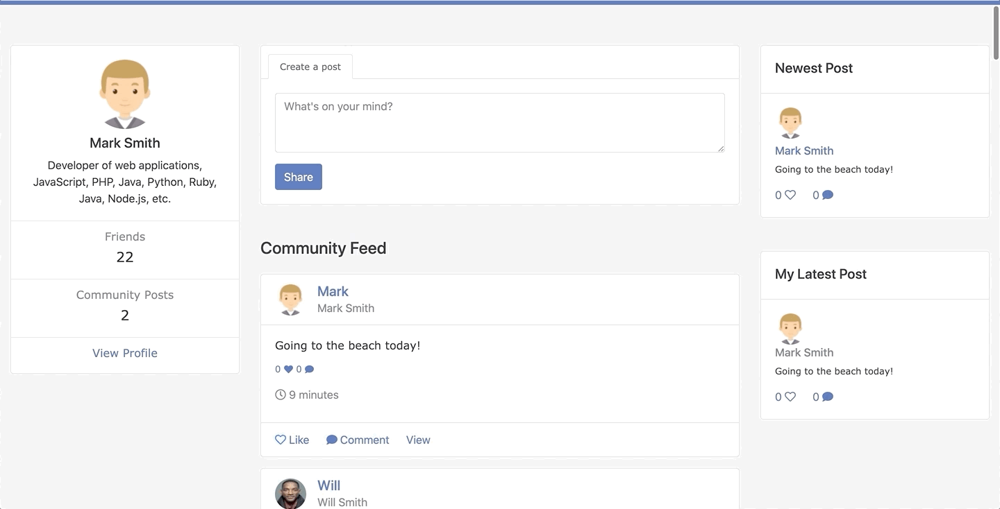

# README

## Project title

Odinbook - A mock Facebook website.

## Motivation

This project is part of The Odin Project's Full Stack Ruby on Rails Curriculum. [https://www.theodinproject.com/courses/ruby-on-rails/lessons/final-project]. This project served as a final project for the Ruby on Rails section incorporate everything we have learned thus far, including

- modelling data
- working with forms
- building new rails applications
- working with simple API's
- Bootstrap Quick Application Design
- Prototyping

## Screenshots





## Tech/framework used

<b>Built with</b>

- Ruby on Rails
- Ruby
- HTML
- CSS
- Bootstrap

## Features

- Create new users
- Delete users
- Add users as friends
- Accept friend requests
- Upload profile image
- Create new posts
- Comment on posts
- Like Posts
- View post timestamps
- Sign in with Facebook (only in development due to API requirements)

## Installation

Git Clone Repository and install on your local machine

Install dependencies using bundle

```bash
bundle install
```

Open on local server

```bash
rails server
```

Log in using credentials

- email: mark@mail.com
- password: password

Or Create your own user.

## API Reference

[Omniauth Facebook](https://github.com/heartcombo/devise/wiki/OmniAuth:-Overview)

## Credits

[The Odin Project](https://www.theodinproject.com/courses/ruby-on-rails/lessons/final-project)
